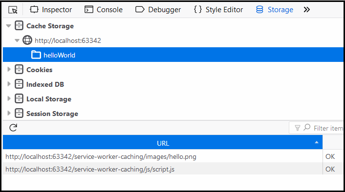

# The Service Worker API and Caching

> An example of using the Service Worker API for caching
>- Provide users with a fast responses from the cache
>- Client side control over caching and how the page handles network requests

## Dependencies

- JavaScript

## Notes

- Test site performance at [webpagetest.org](https://www.webpagetest.org/)
- Service Workers only work with secure origins such as `HTTPS`
- Service Workers can be developed on the local machine using `http://localhost`
- If files load to cache successfully then the Service Worker installs
- If files don't load to cache, the Service Worker fails to install
- Files must be present on the server and downloaded successfully for Service Worker to install
- The longer the list of files to add to the cache, the higher the risk of failure to install

### Coding Steps

- Write code to:
1. Check if browser supports the Service Worker API
2. Name a cache, open it and add an array of items to it
3. Listen for the fetch event

## Caches vs Cache, 
- The difference between`caches.match(event.request)` and `cache.match('someURL').` 
- Caches or CacheStorage stores all caches 
- `caches.match()` should get you the instance of the cache storage 
- [MDN: CacheStorage.match()](https://developer.mozilla.org/en-US/docs/Web/API/CacheStorage/match)
- Cache is just a named cache inside the cache storage. 
- `cache.match()` gives you the instance of a specific cache.
- [MDN: Cache.match()](https://developer.mozilla.org/en-US/docs/Web/API/Cache/match)

### Files cached in Firefox/Storage

## Sources

- [Book/Tutorial: Progressive Web Apps](https://www.manning.com/books/progressive-web-apps)
- [W3C: Script async](https://www.w3schools.com/tags/att_script_async.asp)
- [MDN: Using Service Workers](https://developer.mozilla.org/en-US/docs/Web/API/Service_Worker_API/Using_Service_Workers)
- [MDN: Service Worker API](https://developer.mozilla.org/en-US/docs/Web/API/Service_Worker_API)
- [The difference between Service Workers, Web Workers and WebSockets](https://aarontgrogg.com/blog/2015/07/20/the-difference-between-service-workers-web-workers-and-websockets/)
- [Service Workers, An Introduction](https://developers.google.com/web/fundamentals/primers/service-workers/)
- [JavaScript Promises, An Introduction](https://developers.google.com/web/fundamentals/primers/promises)

